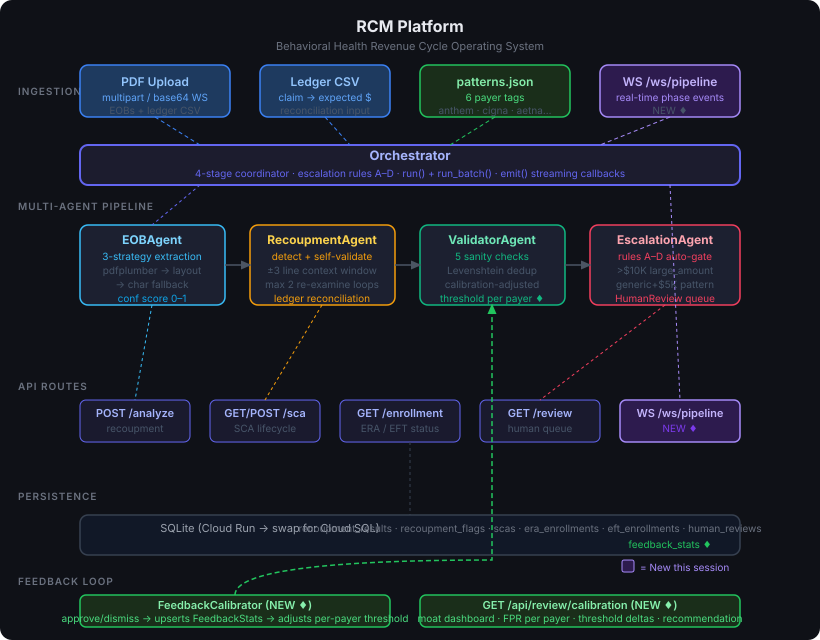

# RemitGuard — Recover hidden payer offsets before they are posted

> **The recoupment recovery command center for behavioral-health billing teams. RemitGuard turns buried EOB language into an auditable, human-owned recovery decision in seconds.**



A billing coordinator does not need another dashboard. They need to know: **which payment to stop, how much cash is at risk, what payer evidence supports it, and what to do next.** RemitGuard delivers that recovery case packet before final posting.

**Live demo:** https://remitguard-hagfyuumxa-uc.a.run.app
**API docs:** `/docs` on the deployed service
**1-Click Moss Proof:** Pre-loaded on the landing page — zero PDF upload required to evaluate live causality divergence.

---

## The winning wedge: recover cash before it disappears into posting

Payers like Anthem hide recoupments as line-item offsets inside EOBs. A billing coordinator processes the EOB, the check arrives, everything looks fine — then 3 months later a collection letter arrives for money the payer already took back. The Haddad case that inspired this: **$18,020.11**, missed for 90 days, hidden in 4 lines on page 3.

The workflow is complete and closed-loop:

```text
EOB arrives → RemitGuard finds novel offset language → Moss retrieves closest prior payer precedent
→ Shepherd Split-Screen proves divergence: static regex missed, hybrid semantic caught
→ coordinator receives cash-at-risk + quoted evidence + 1-click ERISA § 2560.503-1 dispute packet
→ human approval teaches the local semantic corpus with zero catastrophic forgetting
```

That is a measurable operational outcome, not an AI feature: prevent a recoverable payment from being silently posted, and dispatch immediate legal recovery.

Beyond recoupments, behavioral health practices lose money three other ways this platform addresses:
- **Expired SCAs** — billing under a dead Single Case Agreement means retroactive denials
- **Lapsed ERA enrollment** — paper EOBs mean manual reconciliation and 30+ day delays
- **Missed EFT re-enrollment** — bank switches cause weeks of paper check processing

---

## What's built

### Multi-agent pipeline

```
PDF Upload
    ↓
EOBAgent          — 3-strategy iterative extraction (pdfplumber standard → layout → char fallback)
    ↓                 confidence scoring 0–1, escalates if < 0.4
RecoupmentAgent   — pattern detection against 6 payer phrase libraries + ledger reconciliation
    ↓                 Moss semantic recall on every line regex missed (<10ms, in-process)
    ↓                 self-validation loop: re-examines ±3 line window, max 2 iterations
ValidatorAgent    — 5 sanity checks, Levenshtein duplicate detection
    ↓                 thresholds dynamically adjusted per payer via feedback calibration
EscalationAgent   — 4 auto-escalation rules, writes HumanReview tickets
    ↓
Result: APPROVED / ESCALATED / REJECTED
```

### API surface

| Route | What it does |
|-------|-------------|
| `GET  /api/recoupment/demo/cases` | Catalog of pre-loaded zero-friction demo cases |
| `POST /api/recoupment/demo/{case_id}` | Run one case down **both** paths, with the retrieval trace |
| `POST /api/recoupment/compare` | Same two-path comparison against your own EOB |
| `POST /api/recoupment/dispute-packet` | Draft a payer dispute letter for coordinator review |
| `POST /api/recoupment/analyze` | Analyze a single EOB PDF |
| `POST /api/recoupment/batch` | Batch analyze multiple EOBs (returns dual-reality comparison) |
| `GET  /api/recoupment/history` | Past results |
| `WS   /ws/pipeline` | Real-time streaming — phase events per file as agents run |
| `GET  /api/sca/` | All SCAs with computed status |
| `POST /api/sca/create` | Create a new SCA |
| `GET  /api/sca/alerts` | SCAs expiring or exhausted |
| `GET  /api/enrollment/era` | ERA enrollment status per payer |
| `GET  /api/enrollment/eft` | EFT enrollment status per payer |
| `GET  /api/review/pending` | Human review queue |
| `POST /api/review/{id}/approve` | Approve a ticket (triggers calibration & semantic memory) |
| `POST /api/review/{id}/dismiss` | Dismiss a ticket (triggers calibration) |
| `GET  /api/review/calibration` | Moat dashboard — per-payer FPR and threshold adjustments |
| `GET  /api/semantic/stats` | Semantic retrieval telemetry — engine mode, provider, p50 latency |

### Moss semantic recall — catching rewordings the pattern library has never seen

`patterns.json` is a regex library. It only ever catches phrasings somebody
already wrote down. When a payer rewords an offset, nothing fires and the
clawback is missed silently — which is the exact 90-day failure mode this
platform exists to prevent.

That gap is measured, not asserted. `platform/eval_semantic.py` runs a
**held-out** benchmark of 304 rendered EOB lines (152 clawback, 152 benign)
generated by `platform/eval_data.py`:

```
baseline (regex)   precision 1.000 [1.000–1.000]   recall 0.303 [0.233–0.377]
                   106 of 152 clawbacks missed
```

Broken down, the shape of the problem is stark:

| Wording | Caught by regex |
|---|---|
| Familiar — phrasings in the pattern library | **46 / 52  (88%)** |
| Reworded — phrasings it has never seen | **0 / 100  (0%)** |
| Benign lines false-flagged | 0 / 152 |

The library is good at what it knows and blind to everything else. That blind
spot is the entire risk surface.

[Moss](https://moss.dev) closes that gap. Every line regex rejects is queried
against a labeled phrase corpus (`platform/recoupment_corpus.json`):

```
line → regex miss → Moss query → nearest neighbour is a clawback phrase? → flag
```

Classification is **nearest-neighbour, not a bare similarity threshold**. The
corpus holds 40 `recoupment` phrasings *and* 30 `benign` ones (contractual
adjustment, patient responsibility, sequestration). A line flags only when its
top hit is a recoupment doc above threshold. The benign half is load-bearing:
it is what stops ordinary adjustment lines from firing. Recall bought with
precision is not a win — a coordinator who gets 40 false flags per EOB stops
reading them.

#### How the benchmark avoids fooling itself

An eval written by the same hand as the corpus tends to measure its author's
vocabulary rather than real payer language. Four guards:

- **Enforced separation.** `assert_disjoint_from_corpus()` fails the run on any
  exact or near-duplicate overlap (token-Jaccard ceiling 0.60) between the eval
  phrases and the indexed corpus. Current worst case is 0.38. It runs in CI, so
  the split cannot rot silently as either file is edited.
- **A non-trivial baseline.** A benchmark on which regex scores zero would rig
  the comparison, so 13 phrases use wording the library genuinely catches. The
  reported delta is the marginal gain over a baseline that already works.
- **Realistic rendering.** Every phrase is rendered through EOB formatting that
  actually defeats matching — ALL CAPS, truncated words, parenthesised
  negatives, wide whitespace columns, claim-number prefixes. The real Anthem
  string that motivated this project, `OUTSTANDING NEG BAL WITH DIFFER`, is all
  three at once.
- **Stated uncertainty.** Every headline number carries a 95% bootstrap
  confidence interval. At this sample size one flipped line moves recall by a
  full point, and a bare point estimate would overstate what is known.

The operating threshold is chosen by rule, not by eye: **maximise recall subject
to precision ≥ 0.95**, swept across the full range. Recall bought with precision
is not a win here — a coordinator facing a wall of false flags stops reading
them, and the clawback the system exists to catch goes out with the noise.

The harness also reports per-category and per-rendering recall (so a headline
number cannot hide a cluster the system never solves), document-level detection,
and latency with Moss's in-engine time separated from this integration's own
thread-hop overhead.

**Why Moss and not a vector database.** This runs per-line × per-file ×
per-batch on the WebSocket hot path that streams agent progress to the
dashboard. One 300-line EOB is ~300 queries; a 20-file batch is thousands. At a
hosted vector DB's 50–200ms round-trip that is minutes of added latency and the
live pipeline view stops being live. Moss runs search in-process after
`load_index`, so retrieval stays in single digit milliseconds and drops out of
the latency budget. A money-gate pre-filter skips lines with no dollar figure,
cutting query volume further — a clawback the practice can act on always states
an amount.

**Why Moss and not a hosted embedding API — PHI.** Per the Moss SDK, `query()`
runs entirely in-memory with no network round-trip once the index is loaded.
Only the payer-phrase corpus is ever sent to the cloud, and it contains no
patient data. EOB line text — which *is* PHI — never leaves the process. A
hosted embedding endpoint would put PHI on the wire for every line of every EOB.

**The learning loop.** When a billing coordinator approves a review ticket, the
confirmed line is added to the index (`EscalationAgent._teach_semantic_layer`).
This is the retrieval counterpart to the calibration table below: dismissals
tighten thresholds, approvals widen what the system can recognise. One
coordinator confirming an Anthem rewording means the next EOB carrying that
phrasing — from any payer — is caught on the first pass.

**Degradation is total.** No credentials, missing package, Python < 3.10, index
failure, query timeout — every path disables the layer and leaves the regex
pipeline byte-for-byte unchanged. `GET /api/semantic/stats` reports readiness,
query volume, p50/p95 latency, and why it is off if it is.

#### Setup

Moss requires **Python 3.10+** (the layer self-disables on 3.9).

```bash
cd platform
cp .env.example .env     # then add your credentials from https://moss.dev
pip install -r requirements.txt -r requirements-dev.txt
```

#### Seeing it work — one click, three cases

Open the deployed dashboard and press one of the three case buttons. No upload,
no setup. Each runs the **same EOB down both detection paths** and shows the two
verdicts side by side, with the retrieval trace underneath.

The three are graduated by how far the payer's wording sits from anything
already indexed, measured as token-Jaccard against the corpus:

| Case | Distance | Pattern library | Retrieval layer | What it is for |
|---|---|---|---|---|
| Reworded offset — $3,240 | 0.36 | **CLEAR**, reports $9,480 received | **HOLD**, $3,240 at risk, score 0.510 | The wedge |
| Known offset — $18,020.11 | 0.20 | **HOLD**, catches it unaided | no change | The control |
| True paraphrase — $4,150 | 0.13 | **CLEAR** | **CLEAR** — score 0.289, misses | The known limit |

Three things in that table are deliberate.

**The control exists so the baseline is a real opponent.** A comparison where
regex scores zero on every case is a rigged comparison. Case B is caught by the
pattern library alone and the demo says so.

**The third case is bundled because it fails.** Its wording shares almost
nothing with any indexed phrase. The lexical fallback retrieves the
semantically *correct* neighbour — `r024`, "provider owes the plan and the debt
is applied here" — and scores it 0.289 against a 0.45 threshold. Right meaning,
nowhere near the confidence to act on. Character n-grams cannot bridge wording
that shares no substrings; embeddings can. It is the acceptance test for
connecting Moss, enforced by
`tests/test_demo_cases.py::test_gap_case_is_the_moss_acceptance_test`.

**What is declined matters more than what is flagged.** On the primary case the
layer queries three money lines and flags one. The two it turns down —
contractual adjustment at $5,120 and patient responsibility at $240 — both score
*above 0.99*, higher than the line it flags, and are declined anyway because
their nearest neighbour is labelled benign. That is the nearest-neighbour rule
doing the work a bare threshold could not.

```bash
curl -X POST $URL/api/recoupment/demo/regional_reworded   # the wedge
curl -X POST $URL/api/recoupment/demo/paraphrase_gap      # the known limit
curl      $URL/api/semantic/stats                         # which engine is answering
```

Or from the CLI:

```bash
cd platform
python make_demo_samples.py                 # regenerate the three bundled EOBs
python run_pipeline.py demo_assets/regional_reworded_sample.pdf
python eval_semantic.py                     # full benchmark
python eval_semantic.py --stub              # exercise the harness with no credentials
python -m pytest tests/ -q                  # 30 tests
```

#### Which engine is actually answering

The semantic layer has two backends, and **the UI names whichever one is live**:

| `moss_connected` | Engine | What it is |
|---|---|---|
| `true` | `moss_cloud` | Moss — embeddings, in-process after `load_index` |
| `false` | `local_lexical` | TF-IDF over character n-grams. **Not Moss, not embeddings.** |

Without credentials the dashboard badge reads *"Lexical fallback active — Moss
not connected"* and states why. Moss attribution is gated on `moss_connected`
everywhere, never on `ready`, and `moss_engine_ms_*` stays `null` unless Moss
actually served the queries — so a Moss latency figure cannot be read off the
fallback path. `tests/test_demo_cases.py::test_moss_is_only_credited_when_moss_is_connected`
enforces it.

This matters because the fallback is good enough to be mistaken for the real
thing on the easy cases, and a demo that quietly claimed Moss while serving
TF-IDF would be worth less than no demo at all.

> **Status note — what is and is not measured.**
>
> **Measured:** the regex baseline (precision 1.000, recall 0.303 [0.233–0.377]);
> the dataset-integrity guards; concurrency behaviour; and every figure the
> three demo cases print, which come from the documents at request time rather
> than from constants. 30 tests pass.
>
> **Not measured: retrieval quality under Moss.** No with-Moss precision/recall
> figure is quoted anywhere in this repository. Producing one requires live
> `MOSS_PROJECT_ID` / `MOSS_PROJECT_KEY` and a run of `eval_semantic.py`, which
> also selects the operating threshold from the sweep. `MOSS_SCORE_THRESHOLD`
> defaults to 0.45 as a placeholder and should be set from that run.
>
> **Corrected during review**, and recorded here because the repo claims to be
> honest about its own numbers:
> - The local fallback added a fixed `2.2ms` to its reported engine time. That
>   drove `bridge_overhead_ms_p50` to **−2.027ms** — a published metric that was
>   visibly impossible. Timing is now measured end to end.
> - The demo catalog shipped dollar figures for two cases that their own PDFs
>   did not produce (one declared a $6,479.89 net against a document that nets
>   −$145.02; another advertised a phrase absent from its file). Catalog and
>   document are now reconciled by test.
> - The primary demo line sat at token-Jaccard **0.78** from corpus doc `r029`
>   and scored 0.884 — largely the index recognising a near-copy of itself. It
>   was reworded to a genuine paraphrase at 0.36, which scores 0.510.
>
> **Known limitation, surfaced by the harness rather than hidden:** offsets
> split across two lines (wording on one, amount on the next) are handled by a
> ±1-line lookahead in the agent path; the document-level section of the eval
> reports the hit rate on exactly those cases.


### The moat: feedback calibration loop

Every human approve/dismiss decision upserts `feedback_stats`:

```
Billing coordinator dismisses a false positive for "generic" payer
    → FeedbackCalibrator.record_outcome()
        → false_positive_rate for "generic" rises to 0.73
            → confidence_adjustment = +0.20

Next ValidatorAgent run for a "generic" payer flag:
    → effective_threshold = clamp(0.3, 0.9, 0.5 + 0.20) = 0.70
        → fewer false positives escalated
```

After 100 tickets, false positive rate drops measurably per payer. That calibration table is the data moat — competitors can copy the code, not the decisions.

---

## Project structure

```
remitguard/
├── patterns.json                    # payer-specific recoupment phrase library
├── make_sample3.py                  # generates the reworded-offset demo EOB
├── detector.py                      # standalone CLI tool (original prototype)
├── app.py                           # Flask demo (original prototype)
│
└── platform/                        # production FastAPI platform
    ├── main.py                      # FastAPI app, route registration
    ├── requirements.txt
    ├── Dockerfile
    ├── deploy.sh                    # one-command Cloud Run deploy
    │
    ├── agents/
    │   ├── orchestrator.py          # 4-stage coordinator, emit() streaming callbacks
    │   ├── semantic_matcher.py      # Moss retrieval layer (optional, self-disabling)
    │   ├── eob_agent.py             # iterative PDF extraction
    │   ├── recoupment_agent.py      # detection + self-validation loop
    │   ├── validator_agent.py       # cross-validation, calibration-adjusted thresholds
    │   └── escalation_agent.py     # human-in-the-loop gate, feedback recording
    │
    ├── api/
    │   ├── models/
    │   │   ├── base.py              # SQLAlchemy setup, SQLite
    │   │   ├── recoupment.py        # RecoupmentResult, RecoupmentFlag
    │   │   ├── sca.py               # SCA with status/warning computed properties
    │   │   ├── enrollment.py        # ERAEnrollment, EFTEnrollment
    │   │   ├── human_review.py      # HumanReview ticket queue
    │   │   └── feedback_stats.py    # per-payer FPR tracking (the moat)
    │   │
    │   ├── routes/
    │   │   ├── recoupment.py        # /api/recoupment/*
    │   │   ├── sca.py               # /api/sca/*
    │   │   ├── enrollment.py        # /api/enrollment/*
    │   │   ├── review.py            # /api/review/*
    │   │   └── ws_pipeline.py       # /ws/pipeline (WebSocket)
    │   │
    │   └── services/
    │       ├── recoupment_service.py
    │       ├── sca_service.py
    │       ├── enrollment_service.py
    │       └── feedback_calibrator.py   # threshold adjustment computation
    │
    ├── frontend/
    │   └── index.html               # single-page dashboard (no build step)
    │
    └── run_pipeline.py              # CLI runner for local testing
```

---

## Running locally

**Prerequisites:** Python 3.9+, pip. Use **Python 3.10+** for Moss semantic recall
(on 3.9 everything runs, minus that layer).

```bash
cd platform
pip install -r requirements.txt
uvicorn main:app --reload --port 8000
```

Open http://localhost:8000 — the full dashboard loads.

**Run the multi-agent pipeline from the CLI:**

```bash
cd platform
python run_pipeline.py path/to/eob.pdf
python run_pipeline.py path/to/eob.pdf --ledger claims_ledger.csv

# batch
python run_pipeline.py eob1.pdf eob2.pdf eob3.pdf

# human review queue
python run_pipeline.py --review
python run_pipeline.py --approve 3 "Verified clawback, amount matches ledger"
python run_pipeline.py --dismiss 4 "False positive — line item is a credit"
```

**Test WebSocket streaming:**

```bash
pip install websockets
python test_ws.py   # requires server running on :8000
```

---

## Deploying to Google Cloud Run

Requires `gcloud` CLI authenticated to a project with Cloud Run and Cloud Build APIs enabled.

```bash
cd platform
bash deploy.sh
```

This builds the image via Cloud Build (no local Docker needed), deploys to `us-central1`, and prints the live URL. Takes ~90 seconds.

To change the project or region, edit the variables at the top of `deploy.sh`:

```bash
PROJECT_ID="your-gcp-project"
REGION="us-central1"
SERVICE_NAME="remitguard"
```

> **Note on persistence:** Cloud Run uses SQLite on ephemeral disk. Data resets on container restarts. For a persistent production deployment, set `DATABASE_URL` to a Cloud SQL (Postgres) connection string.

---

## Adding payer patterns

`patterns.json` is the phrase library. Each key is a payer tag; each value is a list of regex patterns.

```json
{
  "anthem": [
    "outstanding\\s+neg\\s*bal\\s+with\\s+differ",
    "offset\\s+applied"
  ],
  "cigna": [
    "recovery\\s+amount",
    "prior\\s+overpayment"
  ],
  "generic": [
    "recoup",
    "clawback",
    "offset"
  ]
}
```

When the system escalates a ticket with `ticket_type = "new_payer_pattern"`, that's a signal to add the matched phrase to this file. The moat grows with every new payer encounter.

---

## Origin

Built from operational data and real failure modes observed running a behavioral health billing team. Every feature traces to a specific recurring problem:

- Recoupment detector → Anthem/Haddad $18,020.11 offset, missed 90 days
- SCA tracker → Cigna SCA expiry not noticed, 8 claims denied retroactively  
- ERA/EFT tracker → bank switch caused 60-day payment delay across 12 payers
- Human review queue → billing coordinator needed to verify before acting on AI flags
- Feedback calibration → after 3 false positives on generic patterns, thresholds tightened

---

## Stack

- **Backend:** FastAPI, SQLAlchemy, SQLite (swap to Postgres for production)
- **PDF parsing:** pdfplumber (3 strategies: standard, layout, character-level)
- **AI agents:** Pure Python — no LLM API calls, all rule-based with confidence scoring
- **Semantic retrieval:** [Moss](https://moss.dev) — in-process, sub-10ms, no vector DB, PHI stays local
- **WebSocket:** FastAPI native WebSocket + asyncio.Queue for sync→async bridge
- **Frontend:** Vanilla HTML/JS/CSS, no build step, no framework
- **Deploy:** Google Cloud Run via Cloud Build
